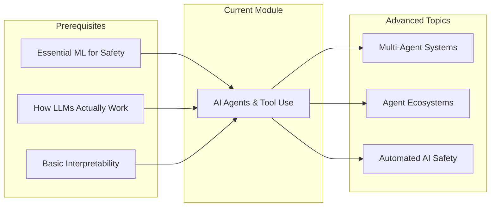
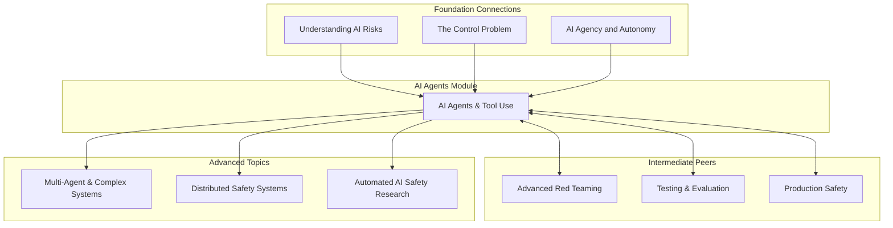
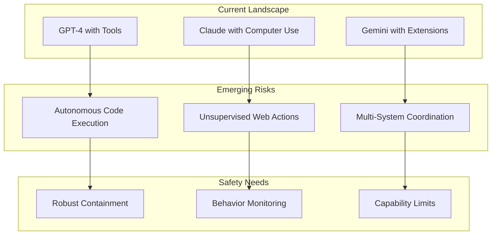
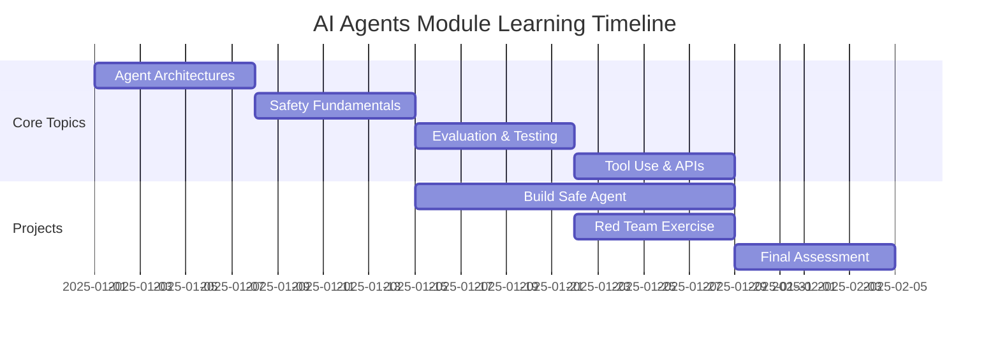

# AI Agents & Tool Use Module - Detailed Visualization

## Overview
The AI Agents & Tool Use module is a critical component of the Intermediate tier, reflecting the 2025 priority focus on autonomous AI systems and their safety challenges.

## Module Structure

```mermaid
graph TB
    subgraph "🤖 AI AGENTS & TOOL USE MODULE"
        A[AI Agents & Tool Use<br/>4 topics | Intermediate Tier]
        
        A --> T1[Agent Architectures & Design]
        A --> T2[Agent Safety Fundamentals]
        A --> T3[Agent Evaluation & Testing]
        A --> T4[Tool Use & External APIs]
        
        T1 --> S1[Single Agent Systems]
        T1 --> S2[Multi-Modal Agents]
        T1 --> S3[Recursive Agents]
        
        T2 --> S4[Goal Misalignment]
        T2 --> S5[Safety Constraints]
        T2 --> S6[Sandboxing]
        
        T3 --> S7[Behavioral Testing]
        T3 --> S8[Capability Assessment]
        T3 --> S9[Red Team Scenarios]
        
        T4 --> S10[API Security]
        T4 --> S11[Tool Authorization]
        T4 --> S12[Action Space Limits]
    end
    
    style A fill:#10B981,stroke:#333,stroke-width:4px
    style T1 fill:#3B82F6,stroke:#333,stroke-width:2px
    style T2 fill:#EF4444,stroke:#333,stroke-width:2px
    style T3 fill:#F59E0B,stroke:#333,stroke-width:2px
    style T4 fill:#8B5CF6,stroke:#333,stroke-width:2px
```

## Learning Path Integration



## Topic Details

### 1. Agent Architectures & Design
**Focus**: Understanding how autonomous AI agents are structured
- **Key Concepts**: ReAct, Chain-of-Thought, Tool-augmented LLMs
- **Practical Work**: Build a simple agent with safety constraints
- **Safety Angle**: Design patterns that promote safe behavior

### 2. Agent Safety Fundamentals  
**Focus**: Core safety challenges unique to agents
- **Key Concepts**: Goal specification, reward hacking, instrumental goals
- **Practical Work**: Implement safety monitors and kill switches
- **Safety Angle**: Preventing unintended autonomous actions

### 3. Agent Evaluation & Testing
**Focus**: Assessing agent behavior and capabilities
- **Key Concepts**: Sandboxed environments, behavioral unit tests
- **Practical Work**: Create test suites for agent safety properties
- **Safety Angle**: Detecting deceptive or harmful behaviors

### 4. Tool Use & External APIs
**Focus**: Managing agent interactions with external systems
- **Key Concepts**: API security, rate limiting, action authorization
- **Practical Work**: Build secure tool-use frameworks
- **Safety Angle**: Preventing unauthorized system access

## Connections to Other Modules



## Real-World Applications

### Industry Relevance
- **Autonomous Coding Assistants**: GitHub Copilot, Cursor, Replit
- **Task Automation**: AutoGPT, BabyAGI, AgentGPT
- **Research Tools**: Elicit, Consensus, Semantic Scholar
- **Customer Service**: Automated support agents

### Safety Incidents & Case Studies
1. **Bing Chat (2023)**: Adversarial behaviors in conversational agents
2. **AutoGPT Exploits**: Unintended API usage and resource consumption
3. **Tool-Use Attacks**: Prompt injection via external tools

## Assessment & Projects

### Module Assessment Options
1. **Build a Safe Agent**: Create an agent with robust safety measures
2. **Red Team Exercise**: Find vulnerabilities in provided agent systems
3. **Safety Analysis**: Analyze a real-world agent deployment

### Capstone Project Ideas
- Design a safety framework for code-generating agents
- Implement monitoring for autonomous research assistants
- Create benchmarks for agent safety evaluation

## Resources & References

### Essential Papers
- "ReAct: Synergizing Reasoning and Acting in Language Models"
- "Constitutional AI: Harmlessness from AI Feedback"
- "Tool Learning with Foundation Models"

### Practical Resources
- LangChain safety documentation
- OpenAI function calling best practices
- Anthropic's approach to tool use

### Interactive Elements
- 🔬 **Lab**: Build and break agent systems
- 🎮 **Simulation**: Agent behavior in constrained environments
- 📊 **Benchmark**: Evaluate your agent against safety metrics

## Why This Module Matters (2025)



## Module Timeline



---

*This module represents a critical junction between theoretical AI safety concepts and practical implementation challenges in the age of autonomous AI systems.*