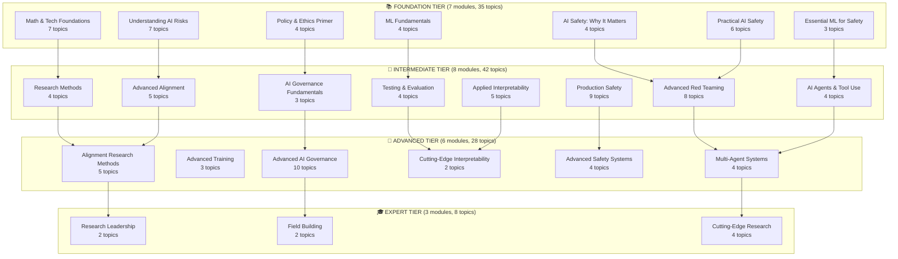

# AI Safety Research Compiler - Current Structure

## Summary
- **4 Tiers**: Foundation → Intermediate → Advanced → Expert
- **24 Modules**: Distributed across tiers (7, 8, 6, 3)
- **113 Topics**: Comprehensive coverage of AI safety

## Mermaid Diagram

## Key Highlights

### 🌟 Largest Modules
1. **Advanced AI Governance & Policy** - 10 topics
2. **Production Safety Engineering** - 9 topics  
3. **Advanced Red Teaming & Adversarial ML** - 8 topics

### 🎯 Focus Areas by Tier

#### Foundation (35 topics)
- Core concepts and motivation
- Hands-on safety basics
- Essential ML knowledge
- Ethics and policy introduction

#### Intermediate (42 topics) 
- Practical tool building
- **AI Agents specialty module** (new!)
- Production engineering skills
- Applied research methods

#### Advanced (28 topics)
- Original research contributions
- Complex system design
- Policy leadership
- Cutting-edge techniques

#### Expert (8 topics)
- Field leadership
- Institution building
- Frontier research

### 📊 Distribution Insights
- **Most content**: Intermediate tier (37% of topics)
- **Most focused**: Expert tier (2.7 topics/module avg)
- **Broadest coverage**: Foundation tier (covers all prerequisites)

## Navigation Paths

The structure supports multiple learning paths:

1. **Technical Track**: Foundation ML → Production Safety → Advanced Systems
2. **Research Track**: Research Methods → Alignment Research → Research Leadership
3. **Policy Track**: Ethics Primer → Governance Fundamentals → Advanced Governance
4. **AI Agents Track**: Essential ML → AI Agents & Tool Use → Multi-Agent Systems

## Database Benefits
- ⚡ 97% reduction in data transfer
- 🔍 Fast search and filtering
- 📈 Dynamic content updates
- 🎯 Personalized progress tracking